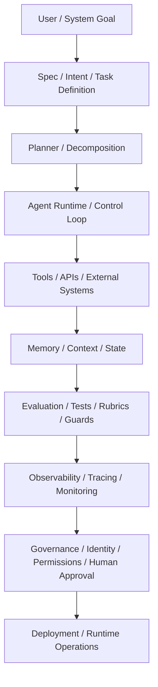

# 🧱 Agentic Engineering Reference Stack

> Audience: practitioners · Evidence class: mixed

A serious agentic system is not a prompt with tools attached. It is nine engineering layers between a user goal and a running production system — and most production failures are a missing layer, not a bad model. This page names the layers, what each one is for, how each one fails, and where to read deeper.

> Read top-to-bottom: a goal becomes a spec, a spec becomes a plan, a plan becomes a run, and that run only earns the right to call itself production-grade once it is bounded by evaluation, observability, governance, and deployment discipline. Skip a layer and every layer above it becomes indefensible.

## The nine layers

| Layer | Purpose | Engineering concern | Common failure mode | What good looks like |
| :--- | :--- | :--- | :--- | :--- |
| **Spec** | Durable, versioned contract for what the system should do and how it should behave. | Acceptance criteria are typed, reviewable, and the source from which plans, code, and tests regenerate. | "Vibe coding": implicit specs that drift across sessions and resist regression. | Spec survives model swaps and team turnover; agents and humans refer back to the same artifact. |
| **Planner** | Decomposes the spec into ordered tasks; routes work to agents and tools. | Plans are explicit, inspectable, and re-plannable on failure — not fused into the executor. | Planner and executor collapse into one loop; replanning happens silently inside a prompt. | Plan surfaces as a first-class artifact with traceable revisions and a clear handoff to execution. |
| **Agent Runtime** | Executes the plan: state, message-passing, tool dispatch, retries, control flow. | Deterministic state transitions, idempotent steps, scoped concurrency, durable resumability. | Hidden global state, opaque emergent loops, no way to replay or resume a failed run. | Inspectable state graph, replayable runs, durable checkpoints, bounded loops. |
| **Tools** | The APIs and actions the agent can invoke — to read external data or change the world. | Typed inputs and outputs, scoped credentials, idempotency, rate limits, structured errors. | Tool sprawl, unauthenticated side-effects, ambiguous error semantics, silent retries. | Typed contracts, structured errors, explicit auth boundaries, a registry that distinguishes read from write. |
| **Memory** | What the agent remembers across turns, sessions, and runs. | Differentiated working / episodic / semantic / procedural stores, eviction policy, retrieval quality. | One vector store for everything; context bloat; retrieval poisoning; no provenance. | Distinct stores by purpose, explicit read and write paths, provenance per memory, measurable retrieval. |
| **Evaluation** | Measures whether the system is doing the right thing, on real cases, repeatedly. | Versioned golden sets, rubrics with inter-rater agreement (κ ≥ 0.6), regression gates in CI. | Vibe-evals; unit tests masquerading as evals; no golden set; metrics that move only when humans look. | Golden sets are versioned artifacts; rubric scores gate PRs; new failures get added to the set. |
| **Observability** | Traces, logs, and metrics that make a run inspectable after the fact. | Structured traces (e.g. OpenTelemetry), per-step latency / cost / retries, prompt and response capture with redaction. | Print-debugging in production; no correlation IDs; logs without spans; cost is invisible until the bill arrives. | Every run yields a trace tree; cost and latency are queryable per step; redaction is automatic, not aspirational. |
| **Governance** | Policies, approvals, and audit trails that bound what an agent may do. | Scoped identity, least-privilege authority, approval gates on consequential actions, revocation paths. | Implicit human authority leaks into agent identity; the audit trail is the chat log; revocation is a code change. | Agents have explicit identity; consequential actions are logged with their approver; access can be revoked in seconds. |
| **Deployment** | How the system runs in production: environment, scaling, rollout, rollback. | Reproducible builds, staged rollout, kill-switches, environment parity, secret management. | Notebook-to-prod; one shared API key; no rollback; "it worked on my laptop" as a release strategy. | Versioned artifacts, infra-as-code, shadow runs, instant kill-switch, parity between staging and prod. |

## Deeper reading

Each layer maps to existing material in this repo. Use the table above as the index; follow these links for depth.

- **Spec** → [Spec-Driven Development](../README.md#-spec-driven-development)
- **Planner** → [Reasoning & Planning Models](../README.md#-reasoning--planning-models)
- **Agent Runtime** → [Orchestration Frameworks](../README.md#-orchestration-frameworks), [Reference Architectures](../README.md#-reference-architectures)
- **Tools** → [Protocols and Standards](../README.md#-protocols-and-standards)
- **Memory** → [Memory Systems](../README.md#-memory-systems)
- **Evaluation** → [Formal Evaluation Rubric](../README.md#-formal-evaluation-rubric), [RUBRIC.md](../RUBRIC.md), [Benchmark and Evidence Policy](benchmark-and-evidence-policy.md)
- **Observability** → not yet covered as a standalone reference; flagged for a follow-up appendix.
- **Governance** → [Agent Authority, Identity & Delegation](../README.md#-agent-authority-identity--delegation)
- **Deployment** → not yet covered as a standalone reference; flagged for a follow-up appendix.

## How to use the stack

This is the repo's **engineering vocabulary**, not a maturity model. A maturity model would describe a progression from script to ecosystem; the stack describes the layers any one system has, at any maturity level. The two are complementary: a Level 1 prompt script still has all nine layers — most of them are just implicit, undefined, or absent. The job of agentic engineering is to make every layer explicit, inspectable, and tested.

When reviewing a system — your own or someone else's — walk the table top to bottom and ask the **What good looks like** question for each layer. The first row that does not have a confident answer is the next thing to build.
